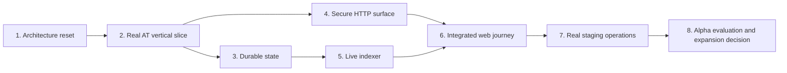

# Patchwork Continuation Roadmap Implementation Plan

> **For agentic workers:** Execute this plan task-by-task. Recommended path:
> dispatch a fresh subagent per task, review each result with `review-quality`,
> then continue. For complex multi-agent splits, use
> `parallel-feature-development`, `team-composition-patterns`, and
> `team-communication-protocols`. Steps use checkbox (`- [ ]`) syntax for
> tracking.

**Goal:** Convert Patchwork from a fixture-heavy, well-tested prototype into a narrowly scoped, durable AT Protocol alpha that can be operated safely in staging and evaluated with a small pilot.

**Architecture:** Preserve the existing lexicons, shared domain rules, privacy helpers, and web UX where they remain useful. Replace fixture runtime boundaries one vertical slice at a time: real AT identity and record operations, durable projections and operational state, secured HTTP APIs, live ingestion, integrated web journeys, and a real staging deployment. Expansion features remain frozen until the alpha gate passes.

**Tech Stack:** Node.js 22, TypeScript, React 19, Vite, PostgreSQL 16, AT Protocol OAuth and repository APIs, Jetstream or `com.atproto.sync.subscribeRepos`, Vitest, Playwright, Docker, GitHub Actions, Prometheus metrics.

---

## Authority and scope

This document supersedes the sequencing assumptions in `docs/IMPLEMENTATION_PLAN.md`, `docs/FULL_APP_FEATURE_ISSUE_PLAN.md`, `docs/PRODUCTION_ISSUE_PLAN.md`, `wave-0.md` through `wave-5.md`, and the dated milestone statuses in `docs/operations/production-readiness-board.md`. Those files remain historical design inputs.

The alpha includes only:

- real AT sign-in and session refresh;
- create, read, update, close, and delete for `app.patchwork.aid.post` records;
- live ingestion into a durable PostgreSQL projection;
- privacy-preserving map and feed discovery;
- a minimal request lifecycle and report/block path;
- a web client with no production fixture fallback;
- a single-region staging environment with backup, restore, metrics, and rollback evidence.

The alpha explicitly excludes groups, reputation scoring, organization portals, volunteer scheduling, native mobile, multi-region operation, external connectors, attachments, and automated matching. Existing code for these features remains compile- and test-covered but receives no expansion work before Phase 8.

## Delivery rules

- Execute phases in order. A phase closes only when its exit gate is demonstrated on the shared staging path.
- Use one issue and one primary pull request per numbered task below.
- Begin each implementation task with a failing test or executable acceptance check.
- Keep fixture implementations available only to unit tests and explicitly named local demo modes.
- Never allow a production build to silently substitute fixtures after an integration failure.
- Run `npm run check`, PostgreSQL/HTTP integration, direct service integration, browser E2E, coverage, and `npm run build` before every phase-closing merge.
- Record phase evidence under `docs/operations/evidence/phase-N/` using committed Markdown summaries without credentials or user data.

## Target file map

| Area | Planned responsibility |
| --- | --- |
| `docs/architecture/current-state-matrix.md` | Authoritative subsystem maturity inventory |
| `docs/architecture/adr/0003-at-alpha-data-boundaries.md` | On-protocol, projection, and private-state boundaries |
| `packages/at-client/` | Real AT OAuth, session, repository, and blob-free record client |
| `services/api/src/auth/` | HTTP session boundary backed by the AT client and PostgreSQL |
| `services/api/src/records/` | Aid-post commands and ownership enforcement |
| `services/api/src/db/migrations/` | API session, lifecycle, report, block, and audit schemas |
| `services/indexer/src/stream/` | Live stream connection, reconnect, cursor, and filtering logic |
| `services/indexer/src/db/` | Durable normalized projections and dead-letter storage |
| `services/moderation-worker/src/db/` | Durable moderation queue and audit repositories |
| `apps/web/src/auth/` | Login, callback, refresh, logout, and recovery UX |
| `apps/web/src/features/api-client.ts` | Method-aware authenticated API client without production fallback |
| `docker-compose.staging.yml` | Runnable single-region staging topology |
| `.github/workflows/ci.yml` | Persistent integration gates and image publication |
| `.github/workflows/deploy-staging.yml` | Actual staging deployment, migration, smoke, and rollback workflow |
| `docs/operations/evidence/` | Phase exit evidence and go/no-go records |

## Phase dependency map



## Phase 1 — Establish an authoritative current state

### Task 1.1: Classify every runtime subsystem

**Files:**
- Create: `docs/architecture/current-state-matrix.md`
- Modify: `README.md`
- Modify: `docs/operations/production-readiness-board.md`

- [x] Inventory authentication, AT record operations, ingestion, discovery, lifecycle, chat, moderation, settings, verification, notifications, groups, organizations, scheduling, reputation, matching, mobile, tenancy, and connectors.
- [x] Give each subsystem exactly one current maturity label: `contract-only`, `fixture-runtime`, `partially-persistent`, `externally-integrated`, or `production-ready`.
- [x] For each label, cite the runtime constructor, persistence implementation, integration test, and known data-loss boundary.
- [x] Replace dated board statuses with links to this matrix; preserve old issue numbers only as historical references.
- [x] Add a README “Current maturity” section stating that the repository is a pre-alpha until Phase 7 closes.
- [x] Run `rg -n "production-ready|AT Protocol-native|fully implemented" README.md docs` and reconcile claims that conflict with the matrix.
- [ ] Commit as `docs: establish Patchwork current-state matrix`.

### Task 1.2: Decide AT and private-data boundaries

**Files:**
- Create: `docs/architecture/adr/0003-at-alpha-data-boundaries.md`
- Modify: `docs/architecture/domain-map.md`
- Modify: `docs/architecture/service-boundaries.md`
- Modify: `docs/at-protocol/README.md`

- [x] Define aid posts as user-owned AT repository records and PostgreSQL discovery rows as rebuildable projections.
- [x] Define sessions, exact location inputs, blocks, moderation casework, lifecycle audit events, and operator notes as private PostgreSQL state.
- [x] Define which lifecycle status is written back to the AT record and which workflow state remains local.
- [x] Specify deletion behavior from repository tombstone through projection removal, cache invalidation, and private audit retention.
- [x] Specify that exact coordinates never enter AT records, public projections, URLs, or application logs.
- [x] Record the selected ingestion source—Jetstream for the alpha unless a measured requirement demands the repository firehose—and its consistency limits.
- [ ] Commit as `docs: define AT alpha data boundaries`.

**Phase 1 exit gate:** A new engineer can classify every subsystem and determine the authoritative storage location for every alpha datum without consulting the historical wave plans.

## Phase 2 — Prove one real AT Protocol vertical slice

### Task 2.1: Add a real AT client package

**Files:**
- Create: `packages/at-client/package.json`
- Create: `packages/at-client/tsconfig.json`
- Create: `packages/at-client/src/index.ts`
- Create: `packages/at-client/src/oauth-client.ts`
- Create: `packages/at-client/src/record-client.ts`
- Create: `packages/at-client/src/record-client.test.ts`
- Modify: `package.json`
- Modify: `package-lock.json`

- [x] Add the current official AT Protocol OAuth/client packages and pin versions through the lockfile.
- [x] Define `AtSessionClient` with login initiation, callback completion, refresh, and logout operations; do not expose user passwords to Patchwork.
- [x] Define `AidPostRecordClient` with create, get, update, and delete operations for `app.patchwork.aid.post`.
- [x] Adapt repository responses into existing `@patchwork/at-lexicons` validation before returning them to callers.
- [x] Write mocked transport tests for successful writes, stale revision conflicts, invalid records, expired sessions, PDS unavailability, and deletes.
- [x] Run `npm run test -w @patchwork/at-client && npm run typecheck -w @patchwork/at-client`.
- [x] Commit as `feat(at): add OAuth and aid-post repository client`.

### Task 2.2: Add real session persistence and API auth

**Files:**
- Create: `services/api/src/db/migrations/0002_at_sessions.sql`
- Create: `services/api/src/auth/session-repository.ts`
- Create: `services/api/src/auth/at-auth-service.ts`
- Create: `services/api/src/auth/at-auth-service.test.ts`
- Modify: `services/api/src/index.ts`
- Modify: `services/api/package.json`
- Modify: `packages/shared/src/config.ts`

- [x] Store only the OAuth state, encrypted token material required by the selected client, DID, handle, expiry, and revocation timestamps.
- [x] Add login-start, callback, current-session, refresh, and logout routes using secure HTTP-only cookies.
- [x] Remove `createFixtureAuthService()` from non-test API startup.
- [x] Reject fixture auth whenever `NODE_ENV=production` or `API_DATA_SOURCE=postgres`.
- [x] Test callback-state mismatch, expired state, refresh rotation, logout revocation, missing encryption key, and restart persistence.
- [x] Run the new tests against PostgreSQL in `docker-compose.postgres.yml`.
- [x] Commit as `feat(auth): persist real AT OAuth sessions`.

### Task 2.3: Complete real aid-post CRUD

**Files:**
- Create: `services/api/src/records/aid-post-command-service.ts`
- Create: `services/api/src/records/aid-post-command-service.test.ts`
- Modify: `services/api/src/index.ts`
- Modify: `apps/web/src/features/api-client.ts`
- Modify: `packages/at-lexicons/src/lexicons/app.patchwork.aid.post.v1.json`
- Modify: `docs/at-protocol/lexicon-versioning.md`

- [x] Implement authenticated create, update, close, and delete commands against the signed-in user’s PDS.
- [x] Enforce record ownership from the authenticated DID rather than request parameters.
- [x] Preserve the existing approximate-area privacy contract and reject exact-coordinate fields.
- [x] Require compare-and-swap revision information for update and close operations.
- [x] Return stable conflict, invalid-record, unauthenticated, forbidden, and upstream-unavailable error codes.
- [x] Demonstrate create, read, update, close, and delete against two disposable test-PDS accounts. See `docs/operations/evidence/phase-2/at-record-lifecycle.md`.
- [x] Commit as `feat(records): complete real AT aid-post lifecycle`.

**Phase 2 exit gate:** A disposable AT account can sign in, publish an aid post to its repository, update it, close it, and delete it; another account cannot mutate it. Evidence includes record URIs and redacted request results, never tokens.

## Phase 3 — Make core state durable

### Task 3.1: Add core operational schemas

**Files:**
- Create: `services/api/src/db/migrations/0003_core_operational_state.sql`
- Create: `services/api/src/db/lifecycle-repository.ts`
- Create: `services/api/src/db/block-repository.ts`
- Create: `services/api/src/db/report-repository.ts`
- Create: `services/api/src/db/audit-repository.ts`
- Test: `services/api/src/db/core-operational-state.test.ts`

- [x] Add idempotent tables for request workflow state, transition events, blocks, reports, and append-only audit events.
- [x] Add unique constraints for command idempotency and indexes for actor, subject URI, status, and creation time.
- [x] Put retention metadata on private records and exclude exact coordinates and token material from audit payloads.
- [x] Test migrations from an empty database and from the prior migration level.
- [x] Test restart survival, duplicate command handling, transaction rollback, and subject deletion behavior.
- [x] Commit as `feat(db): add durable alpha operational state`.

### Task 3.2: Replace in-memory core services

**Files:**
- Modify: `services/api/src/lifecycle-service.ts`
- Modify: `services/api/src/authorization-guard.ts`
- Modify: `services/api/src/index.ts`
- Create: `services/api/src/block-service.ts`
- Create: `services/api/src/report-service.ts`
- Test: `services/api/src/durable-core-services.test.ts`

Progress: authenticated PostgreSQL-backed block and report services are wired at `POST /blocks` and `POST /reports`. Lifecycle transitions and timelines are durable. Migrations `0005_lifecycle_assignments.sql`, `0006_assignment_responses.sql`, and `0007_lifecycle_handoffs.sql` add atomic, idempotent assignment, response, handoff, and timeout processing plus transition and audit writes. These routes restore the session and ignore request-supplied actor identity; timeout checks use deterministic command IDs. Confirmed PDS deletion reconciles private workflow state after compare-and-swap succeeds, cascades fulfillment data, and retains one idempotent audit marker. Migration `0008_platform_roles.sql` provides operator-provisioned DID roles with a safe `user` default; durable HTTP authorization resolves the role on every request. Migrations `0009_public_status_sync.sql` and `0010_public_sync_state.sql` plus `POST /at/aid-posts/status/reconcile` let the record author derive public status from durable workflow state, track `pending`/`failed`/`synced` attempts with stable error codes, update through PDS compare-and-swap, and retain the returned CID and one audit checkpoint. Automatic stream-driven reconciliation remains.

- [x] Inject repository interfaces into lifecycle, block, report, and audit services.
- [x] Keep in-memory repositories in test fixtures only.
- [x] Wrap state transition plus audit emission in one database transaction.
- [x] Derive the actor exclusively from the authenticated session.
- [x] Test process restart, concurrent transitions, idempotent retry, forbidden transition, and deleted-record reconciliation.
- [x] Commit the durable core-service replacement as a sequence of verified vertical slices.

### Task 3.3: Make moderation durable

**Files:**
- Create: `services/moderation-worker/src/db/postgres-queue-store.ts`
- Create: `services/moderation-worker/src/db/postgres-audit-store.ts`
- Create: `services/moderation-worker/src/migrations/002_durable_moderation.sql`
- Modify: `services/moderation-worker/src/index.ts`
- Test: `services/moderation-worker/src/durable-queue.test.ts`

Progress: the production runtime requires PostgreSQL, verifies its schema before
listening, and uses durable queue and audit services. A checksummed one-shot
migration runner applies the moderation schema from empty, replays cleanly, and
is a successful-completion dependency of the worker in production and staging
Compose. Development and tests may still opt into the explicit fixture runtime.

- [x] Implement claim-with-lease queue processing using `FOR UPDATE SKIP LOCKED`.
- [x] Persist attempts, next-attempt time, terminal failure, policy decision, and audit history.
- [x] Make policy application idempotent by command ID.
- [x] Fail production startup if PostgreSQL-backed stores cannot initialize.
- [x] Test worker crash after claim, lease expiry, retry backoff, duplicate delivery, and audit persistence.
- [x] Commit the durable moderation work as focused verified slices.

**Phase 3 exit gate:** Sessions, lifecycle events, blocks, reports, and moderation cases survive service restarts; duplicate commands do not duplicate effects.

## Phase 4 — Secure and normalize the HTTP surface

### Task 4.1: Introduce method-aware routing and authenticated principals

**Files:**
- Create: `services/api/src/http/router.ts`
- Create: `services/api/src/http/authenticated-request.ts`
- Create: `services/api/src/http/error-response.ts`
- Modify: `services/api/src/index.ts`
- Test: `services/api/src/http/router.test.ts`

- [x] Route by HTTP method and pathname, returning `405` with `Allow` for unsupported methods.
- [x] Parse bearer or secure-cookie sessions once and attach an immutable authenticated principal.
- [x] Accept command payloads only as bounded JSON bodies; keep credentials and tokens out of URLs.
- [x] Return a stable error envelope with request IDs and no internal exception details.
- [x] Add graceful shutdown that stops accepting requests, drains active work, and closes pools.
- [x] Test malformed JSON, oversized bodies, unsupported media types, missing auth, expired auth, and shutdown behavior.
- [x] Commit the secure routing work as focused verified slices.

### Task 4.2: Enforce perimeter and authorization policy

**Files:**
- Modify: `services/api/src/cors.ts`
- Modify: `services/api/src/rate-limiter.ts`
- Modify: `services/api/src/authorization-guard.ts`
- Create: `services/api/src/http/security-headers.ts`
- Test: `services/api/src/http/perimeter.test.ts`

- [x] Allow only configured origins and reject credentialed wildcard CORS.
- [x] Add security headers, secure-cookie requirements, CSRF protection for cookie-authenticated commands, and trusted-proxy configuration.
- [x] Apply separate rate-limit policies to login, reads, writes, reports, and moderation operations.
- [x] Enforce owner, moderator, and service capabilities at every remaining API command boundary.
- [x] Test origin rejection, CSRF rejection, forwarded-IP spoofing, rate-limit reset, and privilege escalation attempts.
- [x] Commit the API perimeter work as focused verified slices.

### Task 4.3: Remove unsafe compatibility routes

**Files:**
- Modify: `services/api/src/index.ts`
- Modify: `apps/web/src/features/api-client.ts`
- Modify: `README.md`
- Modify: `docs/test-traceability.md`

- [x] Remove query-parameter login, token refresh, mutation, and administrative routes.
- [ ] Convert mutations to `POST`, `PATCH`, or `DELETE` with JSON bodies and explicit idempotency keys.
- [x] Verify logs and request IDs never contain passwords, tokens, exact coordinates, or unredacted DIDs where redaction is required.
- [x] Add a repository scan that fails CI if sensitive or mutation data is read from `URLSearchParams` in runtime entrypoints.
- [ ] Commit as `fix(security): remove query-string credentials and mutations`.

**Phase 4 exit gate:** The API passes an authenticated authorization matrix and perimeter test suite; no credential or mutation input is transported in a query string.

## Phase 5 — Build the live ingestion and projection runtime

### Task 5.1: Add a reconnecting AT event source

**Files:**
- Create: `services/indexer/src/stream/event-source.ts`
- Create: `services/indexer/src/stream/jetstream-source.ts`
- Create: `services/indexer/src/stream/jetstream-source.test.ts`
- Modify: `services/indexer/src/index.ts`
- Modify: `services/indexer/package.json`

- [ ] Connect to the configured stream URL and filter for Patchwork collection NSIDs.
- [ ] Resume from a durable cursor and use bounded exponential backoff with jitter.
- [ ] Validate event framing, reject oversized messages, and expose connected/disconnected/lag metrics.
- [ ] Stop and checkpoint cleanly on `SIGTERM`.
- [ ] Test reconnect, duplicate event, out-of-order event, malformed frame, cursor resume, and shutdown using a local fake stream server.
- [ ] Commit as `feat(indexer): consume live AT events with cursor resume`.

### Task 5.2: Persist normalized projections and dead letters

**Files:**
- Create: `services/indexer/src/migrations/0002_projection_store.sql`
- Create: `services/indexer/src/db/projection-store.ts`
- Create: `services/indexer/src/db/dead-letter-store.ts`
- Modify: `services/indexer/src/pipeline.ts`
- Test: `services/indexer/src/db/projection-store.test.ts`

- [ ] Persist record URI, CID/revision, author DID hash where appropriate, approximate location, searchable fields, lifecycle status, and source cursor.
- [ ] Make create/update/delete application transactional and idempotent.
- [ ] Ignore older revisions and quarantine invalid records with bounded redacted diagnostics.
- [ ] Remove public projections promptly on delete while retaining only policy-approved private audit metadata.
- [ ] Test replay equivalence, stale revision, duplicate event, delete, invalid schema, and database outage recovery.
- [ ] Commit as `feat(indexer): add durable aid-post projections`.

### Task 5.3: Serve discovery from the projection database

**Files:**
- Modify: `services/api/src/query-service.ts`
- Modify: `services/api/src/db/discovery-events.ts`
- Modify: `services/api/src/index.ts`
- Test: `services/api/src/query-service.postgres.test.ts`

- [ ] Make PostgreSQL projections the only production source for map and feed queries.
- [ ] Enforce approximate geography, category, urgency, status, freshness, stable pagination, and deterministic ranking.
- [ ] Add projection freshness to responses and health/readiness checks.
- [ ] Reject production startup when the projection schema is absent or the indexer lag exceeds the configured readiness threshold.
- [ ] Commit as `feat(discovery): query durable live projections`.

**Phase 5 exit gate:** A record written by one disposable AT account appears in map/feed through live ingestion, updates correctly, disappears on delete, and produces stable results after a complete projection rebuild.

## Phase 6 — Integrate the real web alpha journey

### Task 6.1: Add real authentication UX

**Files:**
- Create: `apps/web/src/auth/AuthProvider.tsx`
- Create: `apps/web/src/auth/LoginPage.tsx`
- Create: `apps/web/src/auth/AuthCallbackPage.tsx`
- Create: `apps/web/src/auth/auth-api.ts`
- Modify: `apps/web/src/features/frontend-shell.tsx`
- Test: `apps/web/src/auth/auth-flow.test.tsx`

- [ ] Add login, callback, current-session, expiration, refresh, logout, and recoverable-error states.
- [ ] Preserve the intended destination through login without placing tokens in browser storage or URLs.
- [ ] Show clear recovery for PDS unavailability, denied authorization, stale callback state, and expired sessions.
- [ ] Add keyboard and screen-reader coverage for all authentication states.
- [ ] Commit as `feat(web): integrate AT authentication UX`.

### Task 6.2: Remove production fixture fallback

**Files:**
- Modify: `apps/web/src/features/api-client.ts`
- Modify: `apps/web/src/features/frontend-shell.tsx`
- Modify: `apps/web/src/features/fixtures.ts`
- Modify: `apps/web/vite.config.ts`
- Test: `apps/web/src/features/api-client.test.ts`

- [ ] Permit fixture data only when `VITE_DATA_MODE=fixture` in a local demo build.
- [ ] Treat network, authentication, validation, and server failures as visible typed error states.
- [ ] Ensure production builds fail if fixture mode is configured.
- [ ] Add retry controls without duplicating successful mutations.
- [ ] Commit as `fix(web): prohibit fixture fallback in production`.

### Task 6.3: Complete the alpha browser journey

**Files:**
- Modify: `apps/web/src/features/frontend-shell.tsx`
- Modify: `apps/web/e2e/lifecycle-service.integration.test.ts`
- Create: `apps/web/e2e/at-record-lifecycle.spec.ts`
- Modify: `apps/web/playwright.config.ts`

- [ ] Cover login, create request, discover from a second session, transition the minimal local workflow, report/block, close, and delete.
- [ ] Assert that exact coordinates, tokens, and private moderation notes never appear in the DOM, URL, or captured network responses.
- [ ] Run the test against PostgreSQL and disposable test-PDS accounts rather than mocked browser routes.
- [ ] Save screenshots and traces only on failure, with a redaction check before artifact upload.
- [ ] Run `npx playwright install chromium && npm run test:e2e -w @patchwork/web`.
- [ ] Commit as `test(e2e): cover real AT request lifecycle`.

**Phase 6 exit gate:** Two browser sessions complete the real create-to-discover-to-close/delete journey against persistent services with fixture mode disabled.

## Phase 7 — Replace simulated operations with real staging evidence

### Task 7.1: Make staging topology complete

**Files:**
- Modify: `docker-compose.staging.yml`
- Modify: `docker-compose.yml`
- Modify: `Dockerfile`
- Create: `docs/operations/staging-secrets.md`
- Modify: `docs/operations/staging-environment.md`

- [ ] Provide PostgreSQL connectivity to API, indexer, and moderation worker.
- [ ] Run migrations as a one-shot prerequisite before application readiness.
- [ ] Require real service DID, OAuth metadata, public origins, encryption keys, and database credentials through deployment secret injection.
- [ ] Remove all `did:example`, fixture datasource, and simulated-success defaults from production/staging manifests.
- [ ] Add health checks that validate dependencies and stream freshness rather than process liveness alone.
- [ ] Commit as `feat(ops): complete persistent staging topology`.

### Task 7.2: Publish and deploy immutable artifacts

**Files:**
- Modify: `.github/workflows/ci.yml`
- Create: `.github/workflows/deploy-staging.yml`
- Modify: `docs/operations/progressive-delivery-runbook.md`
- Modify: `docs/operations/rollback-policy.md`

- [ ] Build all four runtime images once, scan them, sign them, and push digest-addressed artifacts to the selected registry.
- [ ] Deploy those exact digests to staging; do not rebuild in the deployment job.
- [ ] Run migrations, readiness checks, and the real browser smoke journey after deployment.
- [ ] Replace echo-only staging checks with commands whose exit status reflects deployed service behavior.
- [ ] Implement rollback to the prior known-good image digests and document database forward-compatibility constraints.
- [ ] Commit as `ci: deploy immutable images to real staging`.

### Task 7.3: Prove backup, restore, monitoring, and incident response

**Files:**
- Modify: `scripts/backup-postgres.sh`
- Modify: `scripts/restore-postgres.sh`
- Modify: `docs/operations/disaster-recovery.md`
- Modify: `docs/operations/incident-response.md`
- Create: `docs/operations/evidence/phase-7/staging-readiness.md`

- [ ] Restore a staging backup into an empty database and verify sessions are invalidated safely while projections and private operational state recover as designed.
- [ ] Record measured recovery time and recovery point results.
- [ ] Alert on API error rate, indexer disconnect/lag, moderation queue age, database unavailability, and failed backup.
- [ ] Execute one indexer-disconnect game day and one database-restore game day.
- [ ] Record commands, timestamps, observed alerts, recovery decisions, and follow-up fixes in the phase evidence document.
- [ ] Commit as `ops: prove staging recovery and alerting`.

**Phase 7 exit gate:** A real staging URL runs immutable artifacts, passes the browser journey, restores from backup, rolls back safely, and emits actionable alerts during documented failure drills.

## Phase 8 — Evaluate the alpha and control future scope

### Task 8.1: Run the alpha go/no-go review

**Files:**
- Create: `docs/operations/evidence/phase-8/alpha-go-no-go.md`
- Modify: `docs/operations/production-readiness-board.md`
- Modify: `README.md`

- [ ] Collect Phase 1–7 exit evidence, unresolved security findings, data-retention decisions, accessibility results, performance envelope, and operator ownership.
- [ ] Require zero open critical/high security findings, successful restore and rollback evidence, and a green real-PDS browser journey.
- [ ] Record a single decision: `NO-GO`, `CONDITIONAL-GO`, or `GO`, with named conditions and expiry dates for every exception.
- [ ] Update README maturity language only to the level demonstrated by the decision.
- [ ] Commit as `docs: record Patchwork alpha go-no-go decision`.

### Task 8.2: Re-evaluate expansion features

**Files:**
- Create: `docs/EXPANSION_DECISION_MATRIX.md`
- Modify: `docs/FULL_APP_FEATURE_ISSUE_PLAN.md`

- [ ] Score groups, reputation, organizations, scheduling, mobile, multi-region, connectors, attachments, matching, and richer chat on user evidence, safety risk, protocol fit, operational cost, and dependency readiness.
- [ ] Choose at most one expansion vertical slice for the milestone following alpha.
- [ ] Archive or explicitly defer roadmap entries that lack pilot evidence.
- [ ] Require the selected slice to include its own persistence, authorization, privacy, operational, and E2E acceptance criteria.
- [ ] Commit as `docs: prioritize post-alpha expansion from evidence`.

### Task 8.3: Start a bounded pilot or close the project cleanly

**Files:**
- Create: `docs/operations/evidence/phase-8/pilot-charter.md` when the decision is `GO` or `CONDITIONAL-GO`
- Create: `docs/operations/evidence/phase-8/project-closure.md` when the decision is `NO-GO`

- [ ] For a pilot, define participant count, geography, support hours, escalation owner, consent language, data-retention window, success metrics, and immediate shutdown triggers.
- [ ] For closure, document retained reusable assets, data destruction steps, infrastructure shutdown, dependency archival, and repository status.
- [ ] Do not begin expansion work until the pilot or closure document is approved by product, engineering, and trust-and-safety owners.
- [ ] Commit as `docs: charter Patchwork pilot` or `docs: close Patchwork continuation` according to the decision.

**Phase 8 exit gate:** Patchwork either enters a bounded, supported pilot with explicit safety constraints or is closed with no live infrastructure or ambiguous roadmap commitments.

## Global acceptance suite

Run this suite at each phase close, adding phase-specific tests as they land:

```bash
npm ci
npm run lint
npm run typecheck
npm run test
npm run test:integration:postgres -w @patchwork/api
npm run test:integration:service -w @patchwork/web
npm run build
npx playwright install chromium
npm run test:e2e -w @patchwork/web
npm run test:coverage
npm audit --omit=dev --audit-level=high
```

Expected result: every command exits zero. Fixture-only tests remain useful, but they cannot satisfy Phase 2, 5, 6, or 7 exit gates.

## Completion definition

The continuation roadmap is complete only when:

- the authoritative matrix contains no alpha subsystem labeled `fixture-runtime`;
- real AT OAuth and aid-post CRUD pass against disposable accounts;
- live ingestion and deletion rebuild a durable projection deterministically;
- core private state and moderation survive restarts;
- the browser journey passes with fixture fallback disabled;
- staging deployment, rollback, restore, alerts, and incident drills have current evidence;
- Phase 8 records an explicit pilot or closure decision;
- post-alpha scope contains no more than one evidence-backed vertical slice.
