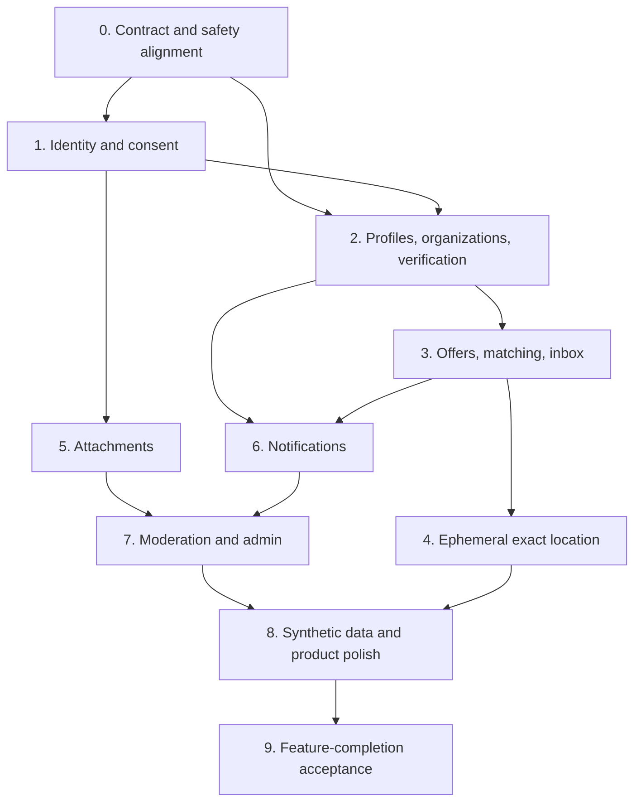

# Patchwork buyer-ready web completion roadmap

Date: 2026-07-28

Execution status: **Complete at the repository/configured-runtime boundary.**
The original Phase 9 acceptance is recorded in
[`buyer-ready-phase-9-feature-completion-2026-07-29.md`](../../operations/evidence/buyer-ready-phase-9-feature-completion-2026-07-29.md).
The 2026-08-04 product-gap sprint and fresh acceptance rerun are recorded in
[`buyer-ready-product-gap-sprint-2026-08-04.md`](../../operations/evidence/buyer-ready-product-gap-sprint-2026-08-04.md).
The operational launch decision remains **NO-GO**.

Product authority:
[`buyer-ready-web-charter.md`](../../product/buyer-ready-web-charter.md)

Baseline:
[`buyer-ready-gap-assessment.md`](../../product/buyer-ready-gap-assessment.md)

## Goal and authority boundary

Deliver the responsive web product defined by the buyer-ready charter without
reintroducing fixture fallback into production.

This roadmap authorizes feature-completion work. It does not supersede the
operational launch decision in
[`alpha-go-no-go.md`](../../operations/evidence/phase-8/alpha-go-no-go.md).
A deployed build is not an approved public service until the launch evidence
is separately refreshed.

## Delivery rules

- Complete work as end-to-end vertical slices: schema, service, authorization,
  HTTP contract, web UX, retention/export/deactivation, tests, and evidence.
- Never mark a contract, fixture service, mock provider, or rendered shell as a
  completed runtime feature.
- Preserve the PDS as authority for user-owned public AT records and PostgreSQL
  as authority for private operational state.
- Use session-derived identity for every authenticated action.
- Treat geoprivacy, authorization, moderation, and deletion regressions as
  release blockers.
- Remove or make unreachable the corresponding fixture production path when a
  slice becomes durable.
- Update the current-state matrix only after tests and runtime evidence exist.
- Keep chat as a placeholder; do not productize chat while executing this
  roadmap.

## Dependency map



## Phase 0 — Align contracts and safety boundaries

### 0.1 Record the location architecture

- Amend ADR 0003 so personal exact location is never persisted.
- Specify authenticated WebRTC signaling, connection authorization, mutual
  consent, expiry, fail-closed behavior, and telemetry redaction.
- Add a directory-only exact-public-address contract gated by organization or
  resource verification plus moderator approval.
- Define confidential-facility exclusion and revocation behavior.
- Add executable schemas and negative fixtures for personal, approximate,
  exact-public, no-permanent-address, and rejected-location cases.

**Exit:** one coherent contract distinguishes approximate personal location,
ephemeral exact personal exchange, and approved exact public-resource address.

### 0.2 Define origin, consent, and capability contracts

- Add immutable server-controlled origin metadata for `synthetic`,
  `sourced-public`, and `visitor-created` records.
- Add source provenance and last-verified fields for sourced organizations.
- Add versioned policy-consent records and the 18+ eligibility assertion.
- Extend capabilities for organization administration, verification review,
  exact-public-address approval, attachment review, and maintenance mode.
- Define the chat-placeholder route contract and remove any production claim
  that fixture chat is available.

**Exit:** schemas reject forged origin/approval state and privilege checks have
negative tests.

## Phase 1 — Complete identity, onboarding, and consent

### 1.1 Productize managed AT account creation

- Complete the managed-PDS registration adapter with abuse limits, handle
  validation, user-owned recovery semantics, and safe upstream error mapping.
- Route successful creation through the same OAuth/session path as existing AT
  accounts.
- Prevent browser-supplied DID, role, verification, or account-origin fields.
- Add recovery UX and clear ownership/federation disclosures.

### 1.2 Make consent and preferences durable

- Persist accepted policy version, timestamp, and required eligibility
  assertion.
- Require renewed consent after material policy changes.
- Persist privacy, notification, visibility, language, and location
  preferences.
- Extend account export and deactivation to these records.

**Phase 1 exit:** a new visitor can create a managed AT account or use an
existing AT account, accept current policies, restore the session after
restart, manage preferences, export data, and deactivate without fixture
state.

## Phase 2 — Productize profiles, organizations, and verification

### 2.1 Make volunteer profiles real

- Add official AT client create/read/update/delete support for volunteer
  profiles.
- Separate public profile fields from private contact and operational fields.
- Add no-permanent-address and approximate service-area support.
- Ingest and project public volunteer profiles with cursor/replay/delete
  semantics.
- Build authenticated profile management and anonymous discovery UX.
- Extend export, deactivation, retention, and block filtering.

### 2.2 Make organizations and stewardship durable

- Add organization, membership, invitation, role, and resource-stewardship
  tables.
- Use real member DIDs; do not invent `did:org:*` identities.
- Enforce owner/admin/steward capabilities in API and UI.
- Add public organization pages with provenance and non-endorsement labels.
- Add 90-day resource reconfirmation jobs and notification events.

### 2.3 Build verification, exact-address approval, and appeals

- Persist private evidence metadata, decisions, expiry, revocation, and appeals.
- Store evidence attachments through the Phase 5 private attachment boundary.
- Create moderator review and applicant status UX.
- Require annual renewal.
- Gate exact public-resource projection on active verification and a separate
  moderator approval.
- Quarantine forged, stale, confidential, or unapproved exact addresses.
- Audit every state transition without exposing evidence publicly.

**Phase 2 exit:** volunteer, organization, stewardship, verification, renewal,
revocation, appeal, and exact-public-resource journeys survive restart and pass
authenticated browser tests.

## Phase 3 — Complete offers, matching, inbox, and outcomes

### 3.1 Add durable offers and connections

- Persist offer, accept, decline, expiry, cancellation, and connection state.
- Recheck block, deactivation, moderation, ownership, and request status at
  every transition.
- Keep participant identities private unless the connection state authorizes
  disclosure.
- Integrate with the existing request lifecycle and audit ledger.

### 3.2 Productize explainable matching

- Rank eligible volunteers and resources using category, approximate distance,
  availability, language, accessibility needs, and verification.
- Exclude blocked, inactive, expired, quarantined, or unauthorized candidates.
- Return readable explanations and never assign automatically.
- Add deterministic fairness and boundary tests; do not introduce an opaque
  reputation score.

### 3.3 Make inbox and outcome feedback durable

- Persist per-user activity items and read state.
- Aggregate requests, offers, assignments, verification, moderation, expiry,
  and notification events.
- Add actionable dashboard cards without chat/message categories.
- Add structured post-handoff outcome feedback with participant authorization,
  abuse controls, retention, and export/deactivation handling.

**Phase 3 exit:** two real accounts can discover, offer, accept, complete,
decline, expire, hand off, and record an outcome through the web UI with no
fixture service.

## Phase 4 — Implement ephemeral exact-location exchange

### 4.1 Add short-lived connection signaling

- Authorize signaling only for an accepted, active connection.
- Require fresh mutual location-sharing consent.
- Use short-lived, single-use session identifiers and expiry.
- Keep signaling payloads free of coordinates and redact session identifiers
  from general logs.
- Disable exchange in maintenance mode or when either participant blocks,
  disconnects, deactivates, or loses authorization.

### 4.2 Add encrypted browser exchange

- Establish an authenticated WebRTC data channel.
- Send the exact coordinate only over the live encrypted channel.
- Keep coordinates in bounded browser memory and clear on close, navigation,
  timeout, logout, or error.
- Provide explicit start, active, stop, and failure UX.
- Do not implement a server-persisted fallback.

### 4.3 Prove absence

- Add repository/static checks for forbidden exact-location fields.
- Add integration assertions across PostgreSQL, AT records, HTTP logs,
  notification payloads, analytics, exports, backups, and Playwright artifacts.
- Exercise connection failure, refresh, restart, timeout, revoke, and
  maintenance-mode paths.

**Phase 4 exit:** two connected accounts can consensually exchange an exact
location, and the acceptance suite proves the coordinate did not persist or
leak.

## Phase 5 — Productize attachments

### 5.1 Add private object storage and upload authorization

- Select an S3-compatible private object store and use server-generated object
  keys.
- Enforce authenticated ownership, purpose, MIME/content detection, 10 MB
  limit, quotas, and upload expiry.
- Store only attachment metadata and object references in PostgreSQL.

### 5.2 Add scan, transformation, and access workers

- Integrate real malware scanning.
- Re-encode supported images and remove metadata.
- Validate PDFs and quarantine uncertain content.
- Serve only clean objects through authenticated, short-lived signed access.
- Record scan attempts, retry state, decisions, and moderator actions durably.

### 5.3 Close deletion and privacy paths

- Delete originals and derivatives on content deletion, account deactivation,
  policy expiry, or moderator removal.
- Include safe attachment metadata, never file bodies or signed URLs, in
  account export.
- Add orphan reconciliation and failed-deletion alerts.

**Phase 5 exit:** upload, scan, preview, authorized download, quarantine,
deletion, retry, restart, and deactivation pass against the real object store
and scanner.

## Phase 6 — Productize notifications

### 6.1 Add a durable outbox and in-app center

- Persist notification intent, deduplication key, audience, template version,
  read state, attempts, and dead-letter status.
- Commit domain changes and outbox events atomically.
- Build authenticated notification list, filters, unread count, mark-read, and
  preference UX.

### 6.2 Add email and browser push

- Add a provider-neutral email adapter and production provider configuration.
- Add Web Push subscription, permission, revocation, and delivery handling.
- Require explicit push opt-in.
- Exclude exact location and other private payloads from all channels.
- Add retry/backoff, provider idempotency, bounce/invalid-subscription cleanup,
  and operator visibility.

**Phase 6 exit:** offers, connections, lifecycle changes, verification,
appeals, expirations, and moderation actions deliver deduplicated durable
in-app notifications plus configured external channels across restart.

## Phase 7 — Complete automated moderation and admin UX

### 7.1 Add the pre-publication safety gate

- Compose schema, length, US-location, precision, prohibited-content,
  emergency-intent, sensitive-data, rate-limit, and attachment-scan checks.
- Publish only accepted submissions.
- Quarantine uncertain/high-risk submissions with stable user-safe reasons.
- Make automated providers replaceable and fail closed when required checks
  are unavailable.

### 7.2 Build the moderator console

- Add authenticated queue, filters, evidence-safe preview, decisions, audit,
  appeal, verification, exact-address approval, and attachment controls.
- Add urgent-flag notification to the configured moderator channels.
- Add one-action quarantine and new-submission shutdown.
- Show the two-business-day best-effort response statement without promising a
  service level.

### 7.3 Add maintenance mode

- Disable new submissions and exact-location exchange on declared privacy,
  authorization, abuse, integrity, moderation-backlog, monitoring, or backup
  failures.
- Preserve safe read access and accurate public status messaging.
- Require an audited moderator action to resume.

**Phase 7 exit:** unsafe content cannot bypass the gate, moderator actions are
durable and auditable, appeals work, and fail-closed mode passes browser and
API tests.

## Phase 8 — Build realistic data and finish the product presentation

### 8.1 Add safe persistent showcase data

- Create deterministic, idempotent synthetic seed generation for people,
  requests, offers, lifecycles, outcomes, organizations, moderation, and
  notifications.
- Use fictional people and non-routable contact data.
- Use safe approximate US service areas for synthetic volunteers.
- Import real organizations only from authoritative public sources with
  provenance, retrieval date, and non-participation disclosure.
- Keep synthetic, sourced, and visitor content separable through refresh,
  moderation, export, and deletion.

### 8.2 Polish every included web journey

- Complete anonymous search/filter and authenticated onboarding.
- Complete profile, organization, verification, request, resource, offer,
  connection, attachment, notification, moderation, settings, export, and
  deactivation UX.
- Add loading, empty, stale, error, retry, offline, and maintenance states.
- Keep Chat as an intentional placeholder with no fixture data or mutation.

## 2026-08-05 authorized expansion sprint

The product owner subsequently authorized durable accepted-connection
scheduling, complete English/Spanish localization, production-backed groups,
and bounded production text chat. Implementation and acceptance details are in
[`2026-08-05-coordination-localization-groups-chat-sprint.md`](./2026-08-05-coordination-localization-groups-chat-sprint.md).

Connection scheduling, groups, and bounded text chat have passed their focused
durable slices. They use PostgreSQL-backed authenticated/idempotent routes,
live authorization rechecks, export/deactivation/retention handling,
privacy-safe notification intent, and responsive bilingual UI. Chat is
explicitly server-readable rather than E2EE. Professional translation review,
independent review, protected staging repetition, and the operational `NO-GO`
remain unchanged.
- Apply consistent demo/non-emergency disclosures.
- Extend keyboard, screen-reader, reflow, text-size, and reduced-motion tests.

### 8.3 Align policy and product documentation

- Update legal drafts to 18+, server-readable bounded chat, synthetic-data disclosure,
  ephemeral exact location, approved exact public-resource addresses,
  attachment processing, and notification channels.
- Link the independent accessibility review evidence supplied by the owner.
- Update screenshots, architecture diagrams, API contracts, and the
  current-state matrix to match demonstrated behavior.

**Phase 8 exit:** a new evaluator can understand and complete the product's
primary journeys without developer guidance, unsupported claims, or fixture
behavior.

## Phase 9 — Feature-completion acceptance

Run the existing global gate plus new service dependencies and browser
journeys:

```bash
npm ci
npm run lint
npm run typecheck
npm run test
npm run test:integration:postgres -w @patchwork/api
npm run test:integration:service -w @patchwork/web
npm run build
npm run test:e2e -w @patchwork/web
npm run test:coverage
npm audit --omit=dev --audit-level=high
```

Add acceptance evidence for:

- managed signup and existing-account OAuth;
- versioned consent and 18+ eligibility;
- volunteer and organization ownership;
- verification, annual expiry, revocation, and appeal;
- approved exact public-resource address and rejected private/confidential
  cases;
- offers, matching, inbox, and outcomes;
- exact-location peer exchange plus non-persistence proof;
- real attachment scan/access/deletion;
- in-app, email, and browser-push delivery;
- automated moderation, admin review, and maintenance mode;
- synthetic/sourced/visitor data separation;
- export and deactivation across every new subsystem;
- durable scheduling, group, and bounded-chat restart/privacy journeys.

## Completion definition

The buyer-ready web feature program is complete only when:

- every included charter capability has a real runtime path;
- no included subsystem remains `fixture-runtime` or `contract-only`;
- fixture group/chat mutations are unreachable from production and the durable
  routes disclose their trust and retention boundaries truthfully;
- the full authenticated and anonymous browser journeys pass against a
  production build;
- the current-state matrix and legal/product copy match observed behavior;
- a fresh feature-completion review records remaining risks without converting
  deferred operational certification into an implicit launch approval.
